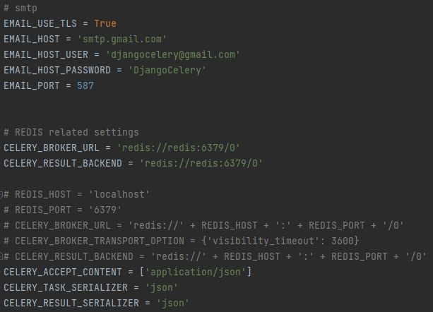

# Django + Celery Проект

## **Описание**

Этот репозиторий демонстрирует полнофункциональную интеграцию между Django и 
Celery, с контейнеризацией через Docker Compose. Основная цель — показать работу, 
как правильно настроил фоновую обработку задач, брокер сообщений и 
мониторинг через Flower в реальном приложении Django.

Ключевые особенности:

- Асинхронные задачи с Celery (например, обработка email, логирование и др.)
- Docker-окружение: Django-приложение, брокер, worker Celery
- Возможность масштабирования воркеров
- Потенциальная поддержка мониторинга через Flower
- Чёткая архитектура и конфигурация для разработки и продакшена

## **Aрхитектура**

- Django: веб-приложение, инициирует задачи.
- Broker Redis: очередь задач, через который задачи передаются воркерам.
- Celery Workers: фоновые процессы, которые выполняют задачи.
- Celery Beat: для периодических задач.
- Логи задач сохраняются (или могут сохраняться) в файл email_log.txt, чтобы можно было видеть, что реально выполняется.

## **Технологии**

- Python и Django — основа веб-приложения
- Celery — распределённая система задач
- Docker — контейнеризация
- Redis — для очередей задач
- Flower — мониторинг задач Celery
- Логи — запись результатов задач (например, email_log.txt)

## **Конфигурация**

В конфигурационных файлах Django settings.py должны быть примерно такие переменные:

**SMTP** нужна для отправки сообщений на почту получателя. 

- `EMAIL_HOST_USER` является почта отправителя (наша выдуманная почта).

**Конфигурации Django и Celery**

- `CELERY_BROKER_URL` — URL брокера задач (например, redis://redis:6379/0 или redis://localhost:6379/0)

- `CELERY_RESULT_BACKEND` — куда отправлять результаты задач

- `CELERY_ACCEPT_CONTENT, CELERY_TASK_SERIALIZER, CELERY_RESULT_SERIALIZER` — формат задач, обычно json

## **Мониторинг и логирование**

- **Логирование задач:** в репозитории есть файл email_log.txt, что используется для записи результатов задач (например, записи отправленных email).

- **Мониторинг с помощью Flower:**

    - Можно настроить сервис Flower в Docker Compose, чтобы визуализировать очередь задач, текущие задачи, статистику.

    - Пример команды запуска для Windows: `celery -A send_email flower`

## **Заключение**

В двух словах — это **образовательный и практичный шаблон** для Django-проекта с Celery и Docker, который может легко развиться в серьёзное приложение.
 написал этот проект, чтобы изучить такие технологии, как Celery и Flower в Django.

## **References**
- [Celery](https://docs.celeryq.dev/en/stable/index.html#)
- [Celery в Django](https://docs.celeryq.dev/en/stable/django/first-steps-with-django.html)
- [Flower](https://docs.celeryq.dev/en/latest/userguide/monitoring.html#flower-real-time-celery-web-monitor)
- [Redis](https://redis.io/docs/latest/develop/clients/redis-py/)